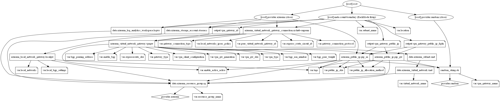

# Virtual Network Gateway terraform module

Terraform module to create a Virtual Network Gateway to send encrypted traffic between an Azure virtual network and an on-premises location over the public Internet. Supports both VPN and ExpressRoute gateway types. VPN configuration supports ExpressRoute (private connection), Site-to-Site and Multi-Site (IPsec/IKE VPN tunnel). Optional active-active mode and point-to-site supported as well.

>## *Creating a virtual network gateway can take up to **45 minutes** to complete. When you create a virtual network gateway, gateway VMs are deployed to the gateway subnet and configured with the settings that you specify*  

Types of resources are supported:

* Point-to-Site
* Site-to-Site
* ExpressRoute

## Module Usage

```hcl
module "vpn-gateway" {
  source  = "kumarvna/vpn-gateway/azurerm"
  version = "1.0.0"

  # Resource Group, location, VNet and Subnet details
  # IPSec Site-to-Site connection configuration requirements
  resource_group_name  = "rg-shared-westeurope-01"
  virtual_network_name = "vnet-shared-hub-westeurope-001"
  vpn_gateway_name     = "shared-vpn-gw01"
  gateway_type         = "Vpn"

  # local network gateway connection
  local_networks = [
    {
      local_gw_name         = "onpremise"
      local_gateway_address = "8.8.8.8"
      local_address_space   = ["10.1.0.0/24"]
      shared_key            = "xpCGkHTBQmDvZK9HnLr7DAvH"
    },
  ]

  # Adding TAG's to your Azure resources (Required)
  tags = {
    ProjectName  = "demo-internal"
    Env          = "dev"
    Owner        = "user@example.com"
    BusinessUnit = "CORP"
    ServiceClass = "Gold"
  }
}
```

## Important

1. Note that IPsec/IKE policy only works on the following gateway SKUs:

   * VpnGw1, VpnGw2, VpnGw3 (route-based)
   * Standard and HighPerformance (route-based)

2. You can only specify one policy combination for a given connection.

3. You must specify all algorithms and parameters for both IKE (Main Mode) and IPsec (Quick Mode). Partial policy specification is not allowed.

4. Consult with your VPN device vendor specifications to ensure the policy is supported on your on-premises VPN devices. S2S or VNet-to-VNet connections cannot establish if the policies are incompatible.

## `GatewaySubnet` - Do I need a GatewaySubnet?

Yes. The gateway subnet contains the IP addresses that the virtual network gateway services use. You need to create a gateway subnet for your VNet in order to configure a virtual network gateway. All gateway subnets must be named 'GatewaySubnet' to work properly. Don't name your gateway subnet something else. And don't deploy VMs or anything else to the gateway subnet.

When you create the gateway subnet, you specify the number of IP addresses that the subnet contains. The IP addresses in the gateway subnet are allocated to the gateway service. Some configurations require more IP addresses to be allocated to the gateway services than do others. You want to make sure your gateway subnet contains enough IP addresses to accommodate future growth and possible additional new connection configurations. So, while you can create a gateway subnet as small as /29, we recommend that you create a gateway subnet of /27 or larger (/27, /26, /25 etc.).

## `local_networks_ipsec_policy` Virtual Network Gateway Connection IPSec Policy  

IPsec and IKE protocol standard supports a wide range of cryptographic algorithms in various combinations. If you do not request a specific combination of cryptographic algorithms and parameters, Azure VPN gateways use a set of default proposals. The default policy sets chosen to maximize interoperability with a wide range of third-party VPN devices in default configurations. As a result, the policies and the number of proposals cannot cover all possible combinations of available cryptographic algorithms and key strengths.

Following parameters can help configure Azure VPN gateways to use a custom IPsec/IKE policy with specific cryptographic algorithms and key strengths, rather than the Azure default policy sets.

Name | Description
---- | -----------
`dh_group`|The DH group used in IKE phase 1 for initial SA. Valid options are `DHGroup1`, `DHGroup14`, `DHGroup2`, `DHGroup2048`, `DHGroup24`, `ECP256`, `ECP384`, or `None`
`ike_encryption`|The IKE encryption algorithm. Valid options are `AES128`, `AES192`, `AES256`, `DES`, or `DES3`
`ike_integrity`|The IKE integrity algorithm. Valid options are `MD5`, `SHA1`, `SHA256`, or `SHA384`
`ipsec_encryption`|The IPSec encryption algorithm. Valid options are `AES128`, `AES192`, `AES256`, `DES`, `DES3`, `GCMAES128`, `GCMAES192`, `GCMAES256`, or `None`
`ipsec_integrity`|The IPSec integrity algorithm. Valid options are `GCMAES128`, `GCMAES192`, `GCMAES256`, `MD5`, `SHA1`, or `SHA256`
`pfs_group`|The DH group used in IKE phase 2 for new child SA. Valid options are `ECP256`, `ECP384`, `PFS1`, `PFS2`, `PFS2048`, `PFS24`, or `None`
`sa_datasize`|The IPSec SA payload size in KB. Must be at least `1024` KB. Defaults to `102400000` KB.
`sa_lifetime`|The IPSec SA lifetime in seconds. Must be at least `300` seconds. Defaults to `27000` seconds

## `local_networks` Local Virtual Network Connections

A local network gateway represents the hardware or software VPN device in your local network. Use this with a connection to set up a site-to-site VPN connection between an Azure virtual network and your local network. Following parameters can help configure Azure local virtual network gateways with your on-premise network.

Name | Description
---- | -----------
`local_gw_name`|The name of the local network gateway
`local_gateway_address`|The IP address of the gateway to which to connect
`local_address_space`|The list of string CIDRs representing the address spaces the gateway exposes
`shared_key`| The shared `IPSec` key. A key could be provided if a `Site-to-Site`, `VNet-to-VNet` or `ExpressRoute` connection is created

## `vpn_client_configuration` IPSec point-to-site connections

A Point-to-Site (P2S) VPN gateway connection lets you create a secure connection to your virtual network from an individual client computer. A P2S connection is established by starting it from the client computer. This solution is useful for telecommuters who want to connect to Azure VNets from a remote location, such as from home or a conference. P2S VPN is also a useful solution to use instead of S2S VPN when you have only a few clients that need to connect to a VNet. Following parameters are required to configure P2S connection with client computer.

Name | Description
---- | -----------
`address_space`|The address space out of which IP addresses for VPN clients will be taken. You can provide more than one address space, e.g. in CIDR notation
`certifciate_path`|The public certificate of the root certificate authority. The certificate must be provided in Base-64 encoded X.509 format (PEM). In particular, this argument must not include the -----BEGIN CERTIFICATE----- or -----END CERTIFICATE----- markers
`vpn_client_protocols`| List of the protocols supported by the VPN client. The supported values are `SSTP`, `IkeV2` and `OpenVPN`

## Recommended naming and tagging conventions

Well-defined naming and metadata tagging conventions help to quickly locate and manage resources. These conventions also help associate cloud usage costs with business teams via chargeback and show back accounting mechanisms.

> ### Resource naming

An effective naming convention assembles resource names by using important resource information as parts of a resource's name. For example, using these [recommended naming conventions](https://docs.microsoft.com/en-us/azure/cloud-adoption-framework/ready/azure-best-practices/naming-and-tagging#example-names), a public IP resource for a production SharePoint workload is named like this: `pip-sharepoint-prod-westus-001`.

> ### Metadata tags

When applying metadata tags to the cloud resources, you can include information about those assets that couldn't be included in the resource name. You can use that information to perform more sophisticated filtering and reporting on resources. This information can be used by IT or business teams to find resources or generate reports about resource usage and billing.

The following list provides the recommended common tags that capture important context and information about resources. Use this list as a starting point to establish your tagging conventions.

Tag Name|Description|Key|Example Value|Required?
--------|-----------|---|-------------|---------|
Project Name|Name of the Project for the infra is created. This is mandatory to create a resource names.|ProjectName|{Project name}|Yes
Application Name|Name of the application, service, or workload the resource is associated with.|ApplicationName|{app name}|Yes
Approver|Name Person responsible for approving costs related to this resource.|Approver|{email}|Yes
Business Unit|Top-level division of your company that owns the subscription or workload the resource belongs to. In smaller organizations, this may represent a single corporate or shared top-level organizational element.|BusinessUnit|FINANCE, MARKETING,{Product Name},CORP,SHARED|Yes
Cost Center|Accounting cost center associated with this resource.|CostCenter|{number}|Yes
Disaster Recovery|Business criticality of this application, workload, or service.|DR|Mission Critical, Critical, Essential|Yes
Environment|Deployment environment of this application, workload, or service.|Env|Prod, Dev, QA, Stage, Test|Yes
Owner Name|Owner of the application, workload, or service.|Owner|{email}|Yes
Requester Name|User that requested the creation of this application.|Requestor| {email}|Yes
Service Class|Service Level Agreement level of this application, workload, or service.|ServiceClass|Dev, Bronze, Silver, Gold|Yes
Start Date of the project|Date when this application, workload, or service was first deployed.|StartDate|{date}|No
End Date of the Project|Date when this application, workload, or service is planned to be retired.|EndDate|{date}|No

> This module allows you to manage the above metadata tags directly or as a variable using `variables.tf`. All Azure resources which support tagging can be tagged by specifying key-values in argument `tags`. Tag `ResourceName` is added automatically to all resources.

```hcl
module "vnet" {
  source  = "kumarvna/vpn-gateway/azurerm"
  version = "1.0.0"

  # ... omitted

  tags = {
    ProjectName  = "demo-internal"
    Env          = "dev"
    Owner        = "user@example.com"
    BusinessUnit = "CORP"
    ServiceClass = "Gold"
  }
}
```

## Requirements

Name | Version
-----|--------
terraform | >= 0.13
azurerm | ~> 2.27

## Providers

| Name | Version |
|------|---------|
azurerm | ~> 2.27
random | n/a

## Inputs

Name | Description | Type | Default
---- | ----------- | ---- | -------
`resource_group_name` | The name of the resource group in which resources are created | string | `""`
`location`|The location of the resource group in which resources are created|string | `""`
`virtual_network_name`|The name of the virtual network|string |`""`
`subnet_name`|The name of the subnet to use in VM scale set|string |`""`
`vpn_gateway_name`|The name of the Virtual Network Gateway|string |`""`
public_ip_allocation_method|Defines the allocation method for this IP address. Possible values are `Static` or `Dynamic`|string| `Dynamic`
`public_ip_sku`|The SKU of the Public IP. Accepted values are `Basic` and `Standard`|string|`Basic`
`gateway_type`|The type of the Virtual Network Gateway. Valid options are `Vpn` or `ExpressRoute`|string|`Vpn`
`vpn_type`|The routing type of the Virtual Network Gateway. Valid options are `RouteBased` or `PolicyBased`|string|`RouteBased`
`vpn_gw_sku`|Configuration of the size and capacity of the virtual network gateway. Valid options are Basic, `VpnGw1`, `VpnGw2`, `VpnGw3`, `VpnGw4`,`VpnGw5`, `VpnGw1AZ`, `VpnGw2AZ`, `VpnGw3AZ`,`VpnGw4AZ` and `VpnGw5AZ` and depend on the `gateway_type`, `vpn_type` and generation arguments|string|`VpnGw1`
`expressroute_sku`|Configuration of the size and capacity of the virtual network gateway for `ExpressRoute` type. Valid options are `Standard`, `HighPerformance`, `UltraPerformance`, `ErGw1AZ`, `ErGw2AZ`, `ErGw3AZ` and depend on the type, `vpn_type` and `generation` arguments|string|`Standard`
`vpn_gw_generation`|The Generation of the Virtual Network gateway. Possible values include `Generation1`, `Generation2` or `None`|string|`Generation1`
`enable_active_active`|If `true`, an `active-active` Virtual Network Gateway will be created. An `active-active` gateway requires a `HighPerformance` or an `UltraPerformance` sku. If `false`, an active-standby gateway will be created|string|`false`
`enable_bgp`|If `true`, BGP (Border Gateway Protocol) will be enabled for this Virtual Network Gateway|string|`false`
`bgp_asn_number`|The Autonomous System Number (ASN) to use as part of the BGP|string|`65515`
`bgp_peering_address`|The BGP peer IP address of the virtual network gateway. This address is needed to configure the created gateway as a BGP Peer on the on-premises VPN devices. The IP address must be part of the subnet of the Virtual Network Gateway|string|`""`
`bgp_peer_weight`|The weight added to routes which have been learned through BGP peering. Valid values can be between `0` and `100`|string|`0`
`vpn_client_configuration`|Virtual Network Gateway client configuration to accept IPSec point-to-site connections|string|`null`
`local_networks`|List of local virtual network connections to connect to gateway|string|`[]`
`local_bgp_settings`|Local Network Gateway's BGP speaker settings|string|`null`
`gateway_connection_type`|The type of connection. Valid options are `IPsec` (Site-to-Site), `ExpressRoute` (ExpressRoute), and `Vnet2Vnet` (VNet-to-VNet)|string|`IPsec`
`express_route_circuit_id`|The ID of the Express Route Circuit when creating an ExpressRoute connection|string|`""`
`peer_virtual_network_gateway_id`|The ID of the peer virtual network gateway when creating a VNet-to-VNet connection|string|`null`
`gateway_connection_protocol`|The IKE protocol version to use. Possible values are `IKEv1` and `IKEv2`|string|`IKEv2`
`local_networks_ipsec_policy`|IPSec policy for local networks. Only a single policy can be defined for a connection|string|`null`
`Tags`|A map of tags to add to all resources|map|`{}`

## Outputs

Name | Description
---- | -----------
`vpn_gateway_id`|The resource ID of the virtual network gateway
`vpn_gateway_public_ip`|The public IP of the virtual network gateway
`vpn_gateway_public_ip_fqdn`|Fully qualified domain name of the virtual network gateway

## Resource Graph



## Authors

Originally created by [Kumaraswamy Vithanala](mailto:kumarvna@gmail.com)

## Other resources

* [Virtual network Gateway](https://docs.microsoft.com/en-us/azure/vpn-gateway/vpn-gateway-about-vpngateways)
* [Terraform AzureRM Provider Documentation](https://www.terraform.io/docs/providers/azurerm/index.html)
